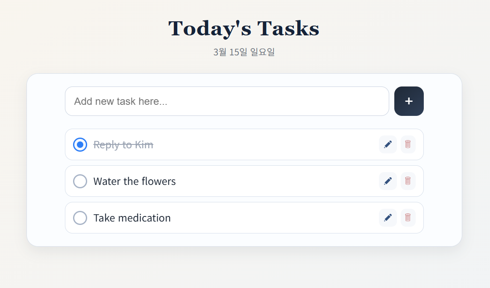

# 웹 TODO



## 서버 실행

서버 디렉토리에 .env 파일을 생성하고 .env.example을 참고하여 URI 값을 설정합니다.

```bash
cd web-todo-server
npm run server
```

## 클라이언트 실행

```bash
cd web-todo-client
npm run dev
```

[http://localhost:5173](http://localhost:5173)으로 접속합니다.

## DB 테스트

```bash
cd web-todo-server
npm run test -- get
npm run test -- post "todo content" [true|false]
npm run test -- put <id> ["todo content"] [true|false]
npm run test -- delete <id>
npm run test -- reset
```
